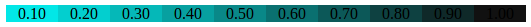

# color-mixture.js
To mix two color with specified ratio. This is a mirror of [hexo/lib/plugins/helper/tagcloud.js](https://github.com/hexojs/hexo/blob/master/lib/plugins/helper/tagcloud.js). 



## Usage

### Define a color

mixture.Color(color_string)

```js
var mixture = require('.');

// hex
new mixture.Color('#0ff') // Color { r: 0, g: 255, b: 255, a: 1 }
new mixture.Color('#00ffff')  // Color { r: 0, g: 255, b: 255, a: 1 }

// rgb
new mixture.Color('rgb(0, 255, 255)')  // Color { r: 0, g: 255, b: 255, a: 1 }

// rgba
new mixture.Color('rgba(0, 255, 255, 0.1)') // Color { r: 0, g: 255, b: 255, a: 0.1 }

// hsl
new mixture.Color('hsl(2, 100%, 50%)')  // Color { a: 1, r: 255, g: 9, b: 0 }

// hsla
new mixture.Color('hsl(2, 100%, 50%, 0.1)') // Color { a: 0.1, r: 255, g: 9, b: 0 }

// color name
new mixture.Color('red') //Color { r: 255, g: 0, b: 0, a: 1 }
```

### Get r,g,b,a of a color
```js
var c = new mixture.Color('red');
c.r  //255
c.g  //0
c.b  //0
c.a  //1
```

### toString
```js
(new mixture.Color('rgb(0, 255, 255)')).toString()        // '#0ff'

(new mixture.Color('rgba(0, 255, 255, 0.1)')).toString()  // 'rgba(0, 255, 255, 0.1)'
```


### Mix 2 color

color1.mix(color2, ratio)


```js
var color1 = new mixture.Color('#000');  // Color { r: 0, g: 0, b: 0, a: 1 }
var color2 = new mixture.Color('#fff');  // Color { r: 255, g: 255, b: 255, a: 1 }

var mix_color = color1.mix(color2, 0.1);  // Color { r: 26, g: 26, b: 26, a: 1 }
```

## License
The same license as [hexo](https://github.com/hexojs/hexo).